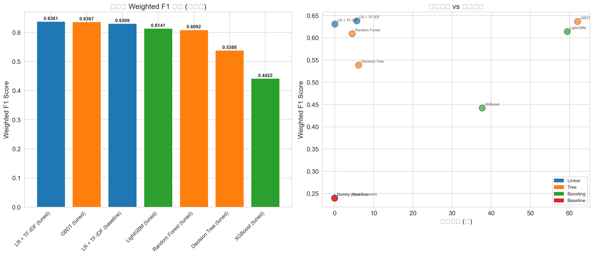

# Amazon Review Star Rating Classification

> 亚马逊商品评论星级分类 — 基于机器学习的 NLP 文本分类项目

A complete machine learning pipeline that classifies Amazon product reviews into 1-5 star ratings. Features a trained Logistic Regression + TF-IDF model, interactive web frontend for real-time prediction, and comprehensive experiment reports.

## Demo

1. Double-click `run.bat` to start
2. Open `http://127.0.0.1:5002` in browser
3. Paste an English product review and get instant star rating prediction



## Features

- **Text Preprocessing**: Lowercasing, negation handling (not good -> not_good), stopword filtering with negation preservation, lemmatization
- **Feature Engineering**: TF-IDF (1-2 grams, 8000 features) + handcrafted features (VADER sentiment, text statistics)
- **Multi-model Comparison**: Logistic Regression, Decision Tree, Random Forest, GBDT, XGBoost, LightGBM
- **Statistical Testing**: McNemar test for model significance
- **Error Analysis**: Confusion patterns, misclassification examples
- **Interactive Frontend**: Real-time prediction with probability distribution, sentiment analysis, and visual insights

## Results

| Model | Weighted F1 | Accuracy |
|-------|------------|----------|
| LR + TF-IDF (tuned) | **0.6294** | 0.6114 |
| GBDT (tuned) | 0.6367 | 0.6757 |
| Random Forest (tuned) | 0.6092 | 0.5967 |
| LightGBM (tuned) | 0.6141 | 0.6213 |
| XGBoost (tuned) | 0.4422 | 0.4332 |

Best model: **Logistic Regression + TF-IDF** on test set.

## Project Structure

```
├── app.py                              Flask backend API
├── train_and_save_model.py             Model training & saving script
├── improved_experiment.py              Full experiment pipeline
├── run.bat                             One-click launcher
├── Big data analysis.json              Raw dataset
├── Big_data_analysis.pptx              Original experiment slides
├── templates/
│   └── index.html                      Frontend UI
├── model/                              Trained models (generated)
├── experiment_outputs/
│   ├── *_Report.docx / *.md            Experiment reports (EN / CN)
│   ├── *.csv                           Model results & predictions
│   └── figures/                        11 EDA & evaluation charts
└── .gitignore
```

## Quick Start

### Prerequisites

- Python 3.8+, with packages: `flask`, `scikit-learn`, `numpy`, `pandas`, `nltk`, `vaderSentiment`, `scipy`

### Launch the App

```bash
# Install dependencies
pip install flask scikit-learn numpy pandas nltk vaderSentiment scipy xgboost lightgbm imbalanced-learn matplotlib seaborn wordcloud

# Train the model (first time only)
python train_and_save_model.py

# Start the server
python app.py
```

Or just double-click **`run.bat`**.

### API Usage

```bash
curl -X POST http://127.0.0.1:5002/predict \
  -H "Content-Type: application/json" \
  -d '{"review": "I absolutely love this product! Works perfectly."}'
```

Response:
```json
{
  "predicted_star": 5,
  "predicted_label": "5 Stars",
  "confidence": 90.07,
  "sentiment": "Very Positive",
  "star_probs": [...],
  "vader_compound": 0.9448
}
```

## Key Improvements Over Original

- Fixed data leakage (strict train/val/test split)
- Added hyperparameter tuning (GridSearchCV with 3-fold CV)
- Enhanced preprocessing (negation handling, lemmatization)
- Integrated VADER sentiment features
- Added McNemar statistical significance tests
- Comprehensive error analysis

## Tech Stack

| Layer | Technology |
|-------|------------|
| NLP | NLTK, VADER Sentiment |
| ML | scikit-learn, XGBoost, LightGBM |
| Backend | Flask |
| Frontend | HTML5, CSS3, JavaScript |
| Visualization | Matplotlib, Seaborn, WordCloud |
